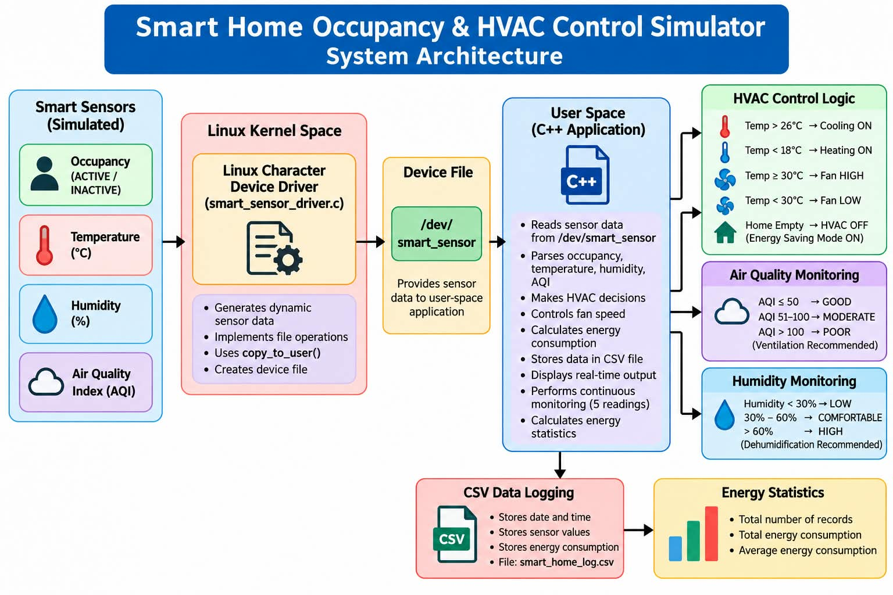

# Smart Home Occupancy & HVAC Control Simulator

## 1. Project Overview

The **Smart Home Occupancy & HVAC Control Simulator** is a Linux-based C/C++ project that simulates an intelligent home environment.

The system collects sensor data through a **Linux Character Device Driver** and uses the data to make automatic HVAC and energy-management decisions.

The system monitors:

- Occupancy
- Temperature
- Humidity
- Air Quality Index (AQI)
- HVAC status
- Fan speed
- Energy consumption

The sensor readings are continuously monitored and stored in a CSV file for analysis.

---

## 2. Objectives

The main objectives of this project are:

1. To implement a Linux character device driver.
2. To generate simulated smart-home sensor readings.
3. To read sensor data through `/dev/smart_sensor`.
4. To detect whether occupants are present.
5. To monitor temperature and control HVAC accordingly.
6. To control fan speed according to temperature.
7. To monitor humidity levels.
8. To monitor Air Quality Index (AQI).
9. To implement an energy-saving mode.
10. To continuously monitor sensor data.
11. To store sensor readings in a CSV file.
12. To calculate energy consumption statistics.
13. To provide energy-saving recommendations.
14. To demonstrate interaction between kernel-space and user-space applications.

---

## 3. Technologies Used

- C
- C++
- Linux
- WSL2 Ubuntu
- Linux Character Device Driver
- Linux Kernel Module
- GCC / G++
- Makefile
- CSV File Handling
- VS Code
- Git
- GitHub

---

## 4. System Architecture

The overall architecture of the project is shown below.



### Architecture Flow

```text
                    +----------------------+
                    |     Smart Sensor     |
                    |----------------------|
                    | Temperature          |
                    | Humidity             |
                    | Occupancy            |
                    | AQI                  |
                    +----------+-----------+
                               |
                               v
                    +----------------------+
                    | Linux Character      |
                    | Device Driver        |
                    +----------+-----------+
                               |
                               v
                       /dev/smart_sensor
                               |
                               v
                    +----------------------+
                    | C++ Smart Home       |
                    | Application          |
                    +----------+-----------+
                               |
             +-----------------+------------------+
             |                 |                  |
             v                 v                  v
       +-----------+     +-----------+      +-----------+
       | Occupancy |     |   HVAC    |      | Air       |
       | Detection |     |  Control  |      | Quality   |
       +-----------+     +-----------+      +-----------+
             |                 |                  |
             +-----------------+------------------+
                               |
                               v
                    +----------------------+
                    | Energy Management    |
                    +----------+-----------+
                               |
                               v
                    +----------------------+
                    | CSV Data Logging     |
                    +----------+-----------+
                               |
                               v
                    +----------------------+
                    | Energy Statistics    |
                    +----------------------+
```

---

## 5. Main Features

### 5.1 Occupancy Detection

The system detects whether the home is occupied.

- `ACTIVE` → Occupant detected
- `INACTIVE` → Home is empty

When the home is empty, the system automatically turns HVAC OFF and activates energy-saving mode.

---

### 5.2 Temperature Monitoring

The system monitors temperature received from the Linux device driver.

The HVAC decision is based on the temperature:

| Temperature | HVAC Action |
|-------------|-------------|
| Below 18°C | Heating ON |
| 18°C – 26°C | HVAC OFF |
| Above 26°C | Cooling ON |
| 30°C or above | Cooling + High Fan |

---

### 5.3 Fan Speed Control

Fan speed is automatically selected according to temperature.

```text
Temperature > 26°C
        |
        +---- 26°C–29°C → LOW Fan Speed
        |
        +---- >= 30°C → HIGH Fan Speed
```

---

### 5.4 Energy Saving Mode

If no occupants are detected:

```text
Occupancy = INACTIVE
        |
        v
HVAC = OFF
        |
        v
Energy Saving Mode = ON
```

This helps reduce unnecessary energy consumption.

---

### 5.5 Humidity Monitoring

The system monitors humidity and displays its status.

| Humidity | Status |
|----------|--------|
| Below 30% | LOW - Air is dry |
| 30%–60% | COMFORTABLE |
| Above 60% | HIGH - Dehumidification recommended |

---

### 5.6 Air Quality Monitoring

The system monitors Air Quality Index (AQI).

| AQI | Status |
|-----|--------|
| 0–50 | GOOD |
| 51–100 | MODERATE |
| Above 100 | POOR |

If AQI is poor, the system recommends ventilation.

---

### 5.7 Energy Consumption

The project estimates energy consumption according to the HVAC state.

Example:

```text
Home Empty
    → 0.0 kWh

Cooling
    → 2.5 kWh

Heating
    → 2.0 kWh

Comfortable Temperature
    → 0.5 kWh
```

These values are simulated estimates for the project and are not measurements from a physical electricity meter.

---

### 5.8 Energy-Saving Recommendations

The system provides recommendations based on the current environment.

Examples:

```text
Home empty:
Turn OFF HVAC to save energy.

Temperature 26–28°C:
Use moderate cooling to save energy.

Temperature above 28°C:
Cooling required. Use high fan speed.

Temperature below 18°C:
Heating required. Maintain minimum heating.

Comfortable temperature:
Keep HVAC OFF.
```

---

## 6. Linux Character Device Driver

The project includes a Linux character device driver implemented in C.

The driver creates the device:

```text
/dev/smart_sensor
```

The C++ application reads sensor information from this device.

Example sensor output:

```text
Smart Sensor Driver
Occupancy: ACTIVE
Temperature: 29 C
Humidity: 55 percent
AQI: 101 (POOR)
```

The driver generates dynamic simulated sensor values using Linux kernel timing information.

---

## 7. User-Space Application

The main application is implemented in C++.

The application:

1. Opens `/dev/smart_sensor`.
2. Reads sensor data.
3. Parses temperature, humidity, occupancy, and AQI.
4. Makes HVAC decisions.
5. Calculates estimated energy consumption.
6. Displays recommendations.
7. Logs readings into a CSV file.
8. Performs continuous monitoring.
9. Calculates energy statistics.

---

## 8. Continuous Monitoring

The application performs multiple sensor readings automatically.

The system performs:

```text
Reading 1
   ↓
Wait 5 seconds
   ↓
Reading 2
   ↓
Wait 5 seconds
   ↓
Reading 3
   ↓
Wait 5 seconds
   ↓
Reading 4
   ↓
Wait 5 seconds
   ↓
Reading 5
```

Each reading is processed and stored in the CSV log.

---

## 9. CSV Data Logging

The system stores sensor readings in:

```text
smart_home_log.csv
```

The CSV file contains:

```text
Date,Time,Occupants,Temperature,Humidity,AQI,Energy
```

Example:

```text
2026-10-02,03:35:24,0,23,52,22,0
```

The logged data can be used for further analysis.

---

## 10. Energy Statistics

After monitoring, the application calculates:

- Total number of records
- Total energy consumption
- Average energy consumption

Example:

```text
--- Energy Statistics ---

Total Records: 6

Total Energy Consumption: 7.5 kWh

Average Energy Consumption: 1.25 kWh
```

---

## 11. Project Structure

```text
capstone_project/
│
├── main.cpp
├── smart_sensor_driver.c
├── Makefile
├── README.md
├── smart_home_log.csv
├── .gitignore
│
└── report/
    └── Project_Report.md
```

Generated kernel build files such as `.ko`, `.o`, `.cmd`, and other temporary files are excluded using `.gitignore`.

---

## 12. Build Instructions

### Step 1: Compile the C++ Application

```bash
g++ -std=c++17 main.cpp -o main
```

---

### Step 2: Build the Linux Driver

```bash
make
```

This generates the kernel module:

```text
smart_sensor_driver.ko
```

---

### Step 3: Load the Driver

```bash
sudo insmod smart_sensor_driver.ko
```

---

### Step 4: Check the Driver

```bash
lsmod | grep smart_sensor
```

---

### Step 5: Check the Device

```bash
ls -l /dev/smart_sensor
```

---

### Step 6: Set Device Permission

```bash
sudo chmod 666 /dev/smart_sensor
```

---

### Step 7: Test the Sensor Driver

```bash
cat /dev/smart_sensor
```

Example:

```text
Smart Sensor Driver
Occupancy: ACTIVE
Temperature: 29 C
Humidity: 55 percent
AQI: 101 (POOR)
```

---

### Step 8: Run the Smart Home Application

```bash
./main
```

---

## 13. Application Menu

The application provides a simple menu:

```text
========================================
   SMART HOME OCCUPANCY & HVAC SYSTEM
========================================
1. Run Smart Home Simulation
2. Exit
========================================
Enter your choice:
```

Select:

```text
1
```

to start the smart-home simulation.

---

## 14. Example Workflow

```text
Sensor Driver
      |
      v
Read Sensor Data
      |
      v
Check Occupancy
      |
      +---- Home Empty
      |        |
      |        v
      |     HVAC OFF
      |        |
      |        v
      |   Energy Saving
      |
      +---- Occupied
               |
               v
        Check Temperature
               |
        +------+------+
        |             |
      High           Low
        |             |
        v             v
    Cooling        Heating
        |
        v
   Fan Control
        |
        v
Check AQI & Humidity
        |
        v
Energy Calculation
        |
        v
CSV Logging
        |
        v
Energy Statistics
```

---

## 15. Advantages

- Demonstrates Linux system programming.
- Demonstrates character device driver development.
- Demonstrates kernel-space and user-space communication.
- Provides automated HVAC control logic.
- Includes energy-saving functionality.
- Supports continuous monitoring.
- Stores sensor data for analysis.
- Provides environmental monitoring.
- Uses C/C++ as required for the project.

---

## 16. Future Enhancements

The project can be extended with:

- Real temperature and humidity sensors.
- Real-time dashboard.
- Web-based monitoring.
- Mobile application.
- Database integration.
- Machine learning based energy prediction.
- Real electricity meter integration.
- Automatic ventilation control.
- Multiple room support.
- Graphical visualization of sensor data.

---

## 17. Conclusion

The **Smart Home Occupancy & HVAC Control Simulator** demonstrates how Linux device drivers and C/C++ applications can be combined to build a smart-home control system.

The project integrates:

```text
Linux Character Driver
        +
Sensor Monitoring
        +
Occupancy Detection
        +
HVAC Control
        +
Air Quality Monitoring
        +
Humidity Monitoring
        +
Energy Management
        +
CSV Logging
        +
Energy Statistics
```

The project provides a practical demonstration of Linux system programming, device-driver concepts, environmental monitoring, and automated energy management.

---

## 18. Author

**Bikash Ranjan Dhir**

B.Tech – Data Science

Project: **Smart Home Occupancy & HVAC Control Simulator**